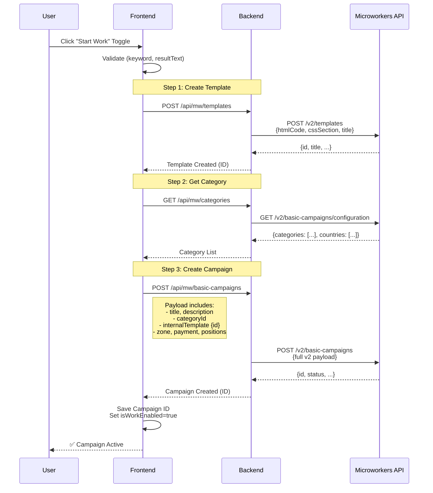
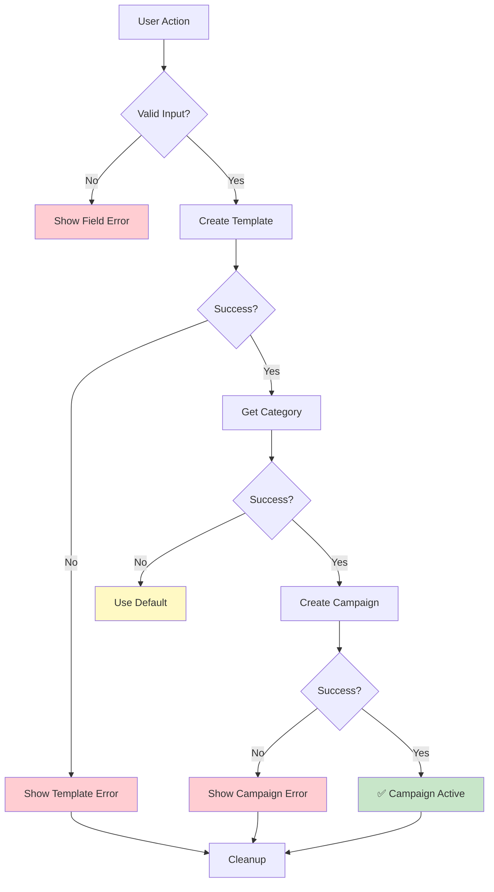

# Microworkers Integration Architecture

## System Flow Diagram



## Component Architecture

```mermaid
graph TB
    subgraph Frontend Application
        UI[PagesManager.tsx<br/>User Interface]
        Service[mockService.ts<br/>API Client]
    end
    
    subgraph Backend Proxy
        Server[server.js<br/>Express Server]
    end
    
    subgraph Microworkers
        Templates[/v2/templates]
        Config[/v2/basic-campaigns/configuration]
        Campaigns[/v2/basic-campaigns]
    end
    
    UI -->|togglePageWork| Service
    UI -->|togglePostWork| Service
    Service -->|HTTP Request| Server
    Server -->|API Call| Templates
    Server -->|API Call| Config
    Server -->|API Call| Campaigns
    
    style UI fill:#e1f5ff
    style Service fill:#e1f5ff
    style Server fill:#fff4e1
    style Templates fill:#f0e1ff
    style Config fill:#f0e1ff
    style Campaigns fill:#f0e1ff
```

## Data Flow

```mermaid
graph LR
    A[Page/Post Data] -->|keyword, resultText| B[Template Creation]
    B -->|Template ID| C[Category Selection]
    C -->|Category ID| D[Campaign Payload]
    D -->|Full v2 Payload| E[Microworkers API]
    E -->|Campaign ID| F[Update Database]
    F -->|isWorkEnabled=true| G[UI Update]
    
    style A fill:#e3f2fd
    style B fill:#fff9c4
    style C fill:#f3e5f5
    style D fill:#e8f5e9
    style E fill:#fce4ec
    style F fill:#e0f2f1
    style G fill:#e1f5fe
```



## Payload Structure

### Template Payload (v2)
```
┌─────────────────────────────┐
│   Template Request          │
├─────────────────────────────┤
│ htmlCode      [required]    │
│ cssSection    [optional]    │
│ jsSection     [optional]    │
│ title         [required]    │
└─────────────────────────────┘
         ↓
┌─────────────────────────────┐
│   Template Response         │
├─────────────────────────────┤
│ id            [use this]    │
│ title                       │
│ htmlCode                    │
│ questions     []            │
│ variables     []            │
│ createdAt                   │
└─────────────────────────────┘
```

### Campaign Payload (v2)
```
┌──────────────────────────────────────┐
│   Campaign Request                   │
├──────────────────────────────────────┤
│ BASIC                                │
│  - title                [required]   │
│  - description          [required]   │
│  - categoryId           [required]   │
│  - paymentPerTask       [required]   │
│                                      │
│ POSITIONS & TIMING                   │
│  - availablePositions   [required]   │
│  - minutesToFinish      [required]   │
│  - ttr                  [required]   │
│  - speed                [required]   │
│                                      │
│ ZONE (pick one)                      │
│  - internationalZone    OR           │
│  - targetedZone                      │
│                                      │
│ TEMPLATE (pick one)                  │
│  - internalTemplate {                │
│      id                 [required]   │
│      adminInstructions               │
│      numberOfSubTasks                │
│      ratingMethodId                  │
│      ...                             │
│    }                                 │
│  - externalTemplate     OR           │
│                                      │
│ SETTINGS                             │
│  - qtRequired                        │
│  - autoSkipTask         {}           │
│  - maximumJobLimit      {}           │
│  - tasks                []           │
│  - notificationSettings []           │
└──────────────────────────────────────┘
```

## Error Handling Flow



## Key Integration Points

1. **Frontend Entry Points**
   - `PagesManager.tsx` → togglePageWork()
   - `PagesManager.tsx` → togglePostWork()

2. **Service Layer**
   - `mockService.ts` → createMicroworkersCampaign()
   - `mockService.ts` → getMwCategories()

3. **Backend Endpoints**
   - `POST /api/mw/templates`
   - `GET /api/mw/categories`
   - `POST /api/mw/basic-campaigns`
   - `POST /api/mw/basic-campaigns/:id/restart`

4. **External API**
   - `POST https://sandbox.microworkers.com/api.php/v2/templates`
   - `GET https://sandbox.microworkers.com/api.php/v2/basic-campaigns/configuration`
   - `POST https://sandbox.microworkers.com/api.php/v2/basic-campaigns`

## Configuration

```
Environment Variables (server.js)
├── MW_API_KEY        (Microworkers API Key)
└── MW_BASE_URL       (https://sandbox.microworkers.com/api.php)

LocalStorage (Frontend)
├── zilseo_api_url    (Backend URL: http://localhost:3001)
└── mw_api_key        (Microworkers API Key)
```

## Testing Points

1. **Unit Test**: Template creation payload
2. **Unit Test**: Campaign creation payload
3. **Integration Test**: Full campaign flow
4. **E2E Test**: UI → Backend → Microworkers → UI

See `test-mw-api.js` for integration testing.
